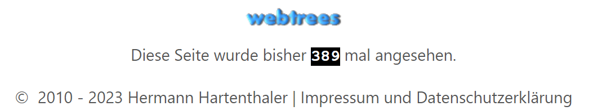
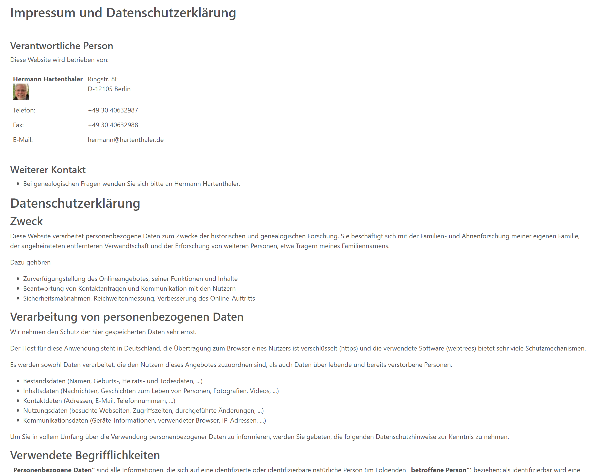
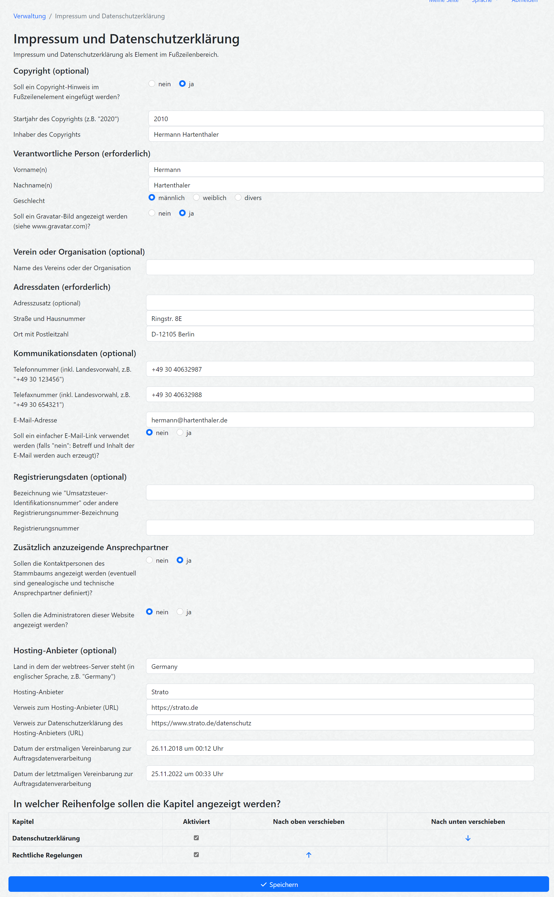

# ⚖️ **webtrees** module for Legal Notice and Privacy Policy (hh_legal_notice)

 

This [webtrees](https://www.webtrees.net) module creates a legal notice in the footer of the web page.

> [!IMPORTANT]
> This module does not provide legal advice.
> You, as administrator of your website, remain responsible for checking and maintaining the legal notice and privacy policy shown on your site.

There is a German [manual page](https://wiki.genealogy.net/Webtrees_Handbuch/Anleitung_f%C3%BCr_Webmaster/Erweiterungsmodule/Legal_Notice) available, too.

## 📚 Contents

This Readme contains the following main sections

* [Purpose](#Purpose)
* [Scope](#Scope)
* [Screenshots](#Screenshots)
* [Requirements](#Requirements)
* [Installation](#Installation)
* [Upgrade](#Upgrade)
* [Contributing](#Contributing)
* [Translation](#Translation)
* [Credits](#Credits)
* [Privacy, telemetry, and tracking](#Privacy)
* [Contact Support](#Support)
* [License](#License)

## 🎯 Purpose

This module adds a legal notice footer to all pages of a webtrees site.

There is maybe a need to present on your website a "Legal Notice"
(depending on your local law and the character of your site)
* Germany: [§5 Digitale-Dienste-Gesetz (DDG)](https://lxgesetze.de/ddg/5), 
and [§4 Medienstaatsvertrag (MStV)](https://lxgesetze.de/mstv/4)
* Austria: § 5 Abs. 1 E-Commerce-Gesetz (ECG)
* Switzerland: Art. 3 des Bundesgesetzes gegen den unlauteren Wettbewerb (UWG)

## 🔎 Scope

The webtrees admin can define the following data fields in the control panel for the responsible person
* name of responsible person
* name of genealogical club or organization
* address
* phone and fax numbers
* eMail address (with or without subject and body of eMail)
* VAT ID number or other registration number (like a club registration number)

The webtrees admin can choose if the following additional parts should be shown
* copyright notice in the footer
* image of the responsible person using the [Gravatar](https://gravatar.com/)
* list of contact persons for a tree (genealogical and technical)
* list of administrators of this site with their contact links
* optional consumer dispute resolution notice for websites whose server is located in the European Union

The generated page is structured into three parts:
* **Legal Notice** with the responsible person and contact details; this part is always shown.
* **Privacy Policy** with several configurable sections; this chapter is optional.
* **Legal Regulations** with several configurable sections; this chapter is optional.

The optional chapters and their sections can be reordered and individually enabled or disabled.
There are two styles provided for those sections: "I" style and "We" style,
depending on the number of website administrators.

If a tree contact or website administrator is the same person as the responsible person named in the legal notice,
the module avoids showing this person as a separate additional contact.
Instead, the relevant contact role is shown directly below the responsible person.

The chapter "Privacy Policy" is a structured draft that can be adapted by the administrator.
The administrator can enable or disable this chapter and configure the order of its sections.
The administrator can also configure the server location, hosting provider, supervisory authority,
third-party services, and whether registered users are relatives or relatives by marriage.

The generated privacy policy can include, depending on the configuration and server location:
* references to German, European, or no specific regional data-protection law
* legal bases for processing under the GDPR where EU law applies
* a named competent supervisory authority with URL
* data protection contact information referring to the responsible person named in the legal notice
* information about hosting, order processing, application logs, third-party services, and third-country transfers
* information about the long-term preservation of genealogical data as historically relevant material
* information about external transcription providers when compatible modules provide such notices

## 🖼 Screenshots

Screenshot of Legal Notice footer (in German language)

Screenshot of Legal Notice (in German language)

Screenshot of control panel page (in German language)

## 📌 Requirements

This module requires **webtrees** version 2.1 or 2.2.
This module has the same requirements as [webtrees#system-requirements](https://github.com/fisharebest/webtrees#system-requirements).

This module was tested with **webtrees** versions 2.1.22 and 2.2.6
and all available themes and all other custom modules.

## 📥 Installation

This section documents installation instructions for this module.

Install and use [Custom Module Manager](https://github.com/Jefferson49/CustomModuleManager) for an easy and convenient installation of **webtrees** custom modules.
+ Open the Custom Module Manager view in **webtrees**, scroll to "Legal Notice and Privacy Policy", and click on the "Install Module" button.

**Manual installation**:

1. Make a database backup.
1. Download the [latest release](https://github.com/hartenthaler/hh_legal_notice/releases/latest).
1. Unzip the package into your `webtrees/modules_v4` directory of your web server.
1. Rename the folder to `hh_legal_notice`.
1. Login to **webtrees** as administrator, go to Control Panel/Modules/Website/Footers, and find the module. It will be called "Legal Notice and Privacy Policy". Check if it has a tick for "Enabled".
1. Click at the wrench symbol and add all desired information fields.
1. Maybe you like to deactivate the module "contact information" (depending whether you have activated this in the "Legal Notice" module).
1. Finally, click SAVE, to complete the installation.

## ⬆️ Upgrade

To update simply replace the `hh_legal_notice` files
with the new ones from the latest release.

### Upgrading from the former hh_imprint module
+ Do NOT delete the module settings of the former `hh_imprint` module before the installation of `hh_legal_notice`.
+ Delete the folder `hh_imprint`in your `webtrees/modules_v4` directory.
+ Install the `hh_legal_notice` module like described in chapter [Installation](#Installation).
+ Open the Control Panel of this footer module; `hh_legal_notice` will takeover the existing settings from `hh_imprint`. You should see a notice.
+ After `hh_legal_notice` has migrated the settings, `hh_imprint` can be removed and the related settings can be deleted (follow the message in the control panel after deletion of the module).

## 🤝 Contributing

If you'd like to contribute to this module, great! You can contribute by

- Reading and commenting the legal chapters carefully - choose a specific topic and please [create an issue](https://github.com/hartenthaler/hh_legal_notice/issues) for that topic.
- Contributing code - check out the issues for things that need attention. If you have changes you want to make not listed in an issue, please create one, then you can link your pull request.
- Testing - it's all manual currently, please [create an issue](https://github.com/hartenthaler/hh_legal_notice/issues) for any bugs you find.

## 🌍 Translation

You can use a local editor,
like Poedit or Notepad++ to make the translations and send them back to me.
You can do this via a pull request (if you know how) or by e-mail.

Discussion on translating can be done by creating an [issue](https://github.com/hartenthaler/hh_legal_notice/issues).

Updated translations will be included in the next release of this module.

There are now, beside English the following languages available
- Catalan (by Bernat Josep Banyuls i Sala)
- Dutch (by TheDutchJewel)
- German (by Hermann Hartenthaler)

## 🙏 Credits

Developed by Hermann Hartenthaler with support from OpenAI Codex and JetBrains PhpStorm.

The module is based on ideas and earlier work from Josef Prause's `jp-privacy-policy` module and related webtrees community discussions.

## 🔒 Privacy, telemetry, and tracking

This module does not collect analytics data, does not track users, and does not send legal-notice content, family tree data, media files, or personal data to the module author.

When the **webtrees** control panel is opened, the module checks whether a newer version is available. This version check requests only the module's public latest-version URL on `github.com`.

The module can optionally show an image of the responsible person through [Gravatar](https://gravatar.com/). If this option is enabled, the visitor's browser requests an image from `www.gravatar.com`; the configured e-mail address is used only as a hash in the Gravatar image URL. Gravatar may process the visitor's IP address and normal browser request metadata. The generated privacy policy can list Gravatar as a third-party service and can mention possible third-country transfer where EU data-protection law applies.

The generated privacy policy can also mention [Google Charts](https://developers.google.com/chart) when the administrator enables this option and the webtrees statistics chart module is active. Google Charts may be loaded from Google servers when statistics charts are viewed.

Additional third-party services can be configured by the administrator using service name, URL, and optional country of service provision. If the website is subject to EU data-protection law and a configured service is provided from outside the European Union, the generated privacy policy can include a third-country-transfer notice.

The privacy-policy page can also include information from other installed modules. For example, if `hh_source_transcription` is installed, this module can show privacy information about external transcription providers such as Transkribus or Discourse.

The wording for the webtrees core cookie behavior is being clarified separately; see issue [#48](https://github.com/hartenthaler/hh_legal_notice/issues/48).

## ❓ Support

**Issues**: for any ideas you have, or when finding a bug you can raise an [issue](https://github.com/hartenthaler/hh_legal_notice/issues).

**Forum**: general webtrees support can be found at the [webtrees forum](http://www.webtrees.net/).

## 📄 License

* Copyright (C) 2026 Hermann Hartenthaler
* Derived from **webtrees** - Copyright 2026 webtrees development team.

This program is free software: you can redistribute it and/or modify
it under the terms of the GNU General Public License as published by
the Free Software Foundation, either version 3 of the License, or
(at your option) any later version.

This program is distributed in the hope that it will be useful,
but WITHOUT ANY WARRANTY; without even the implied warranty of
MERCHANTABILITY or FITNESS FOR A PARTICULAR PURPOSE. See the
GNU General Public License for more details.

You should have received a copy of the GNU General Public License
along with this program. If not, see <http://www.gnu.org/licenses/>.

* * *
